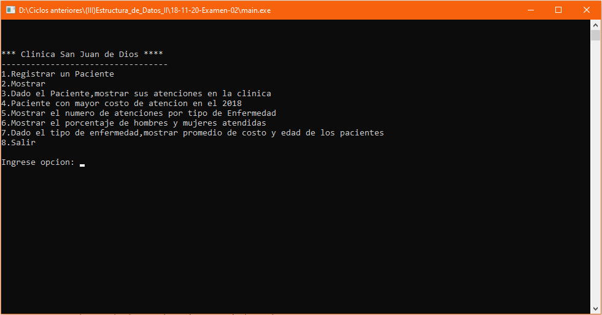

# Control de pacientes
Sistema de control de pacientes de una clínica que permite ingresar los datos de pacientes, mostrar estos datos, mostrar las atenciones clínicas según el nombre del paciente, mostrar el paciente con el mayor costo de atención el año 2018, mostrar la cantidad de atenciones clínicas por tipo de enfermedad, mostrar el porcentaje de hombres y mujeres atendidos, mostrar el promedio de costos de atención y edad de los pacientes según el tipo de enfermedad, **20/11/18**.

<strong>Imagen:</strong> Menú principal.

